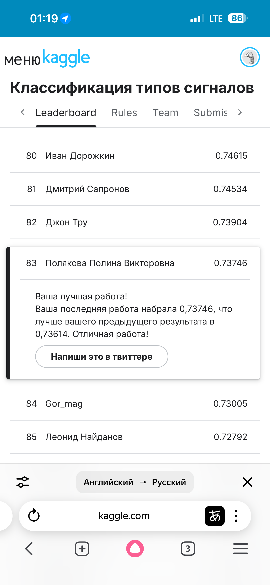

# signal_cluster_project
Сессионное задание: Signal types classification

# Описание проекта:
Современные задачи ядерной энергетики, радиационного контроля, фундаментальной и прикладной физики требуют высокоточной регистрации и анализа излучения различной природы. 
Важной составляющей этих задач является возможность отделения компонентов ионизирующего излучения, таких как гамма-кванты и нейтроны, в условиях сложного фонового окружения. 
Сцинтилляционные детекторы, особенно основанные на органических кристаллах (например, паратерфенил), обладают высокой чувствительностью к подобным видам излучения и активно применяются:
- при контроле состояния отработанного ядерного топлива;
- в системах радиационного мониторинга;
- в физических экспериментах по регистрации антинейтрино и редких событий;
- в медицине и промышленности.

Однако автоматическая классификация сигналов, поступающих с таких детекторов, представляет собой нетривиальную задачу, так как сигналы могут перекрываться, иметь сложную форму, шумы и вариации. 
Вручную такие объёмы данных (десятки тысяч сигналов) анализировать практически невозможно.
Применение методов машинного обучения, в частности кластеризации, позволяет:
- автоматизировать процесс распознавания сигналов разного типа;
- улучшить точность и стабильность выделения физических компонент;
- выявлять аномальные сигналы и потенциальные неисправности в системе регистрации;
- заложить основу для онлайн-анализа в реальном времени без участия оператора.

Разработка и тестирование эффективных алгоритмов кластеризации в данной области напрямую способствует:
- повышению точности научных измерений,
- улучшению качества систем радиационного контроля и безопасности,
- развитию технологий интеллектуальной обработки сигналов в ядерной и экспериментальной физике.

# Цель проекта
Автоматическая **кластеризация сигналов, полученных со сцинтилляционного детектора**, на основе их параметров: необходимо разделить 23 479 сигналов **на три кластера**:
- Кластер 0 — сигналы, соответствующие первому типу частиц (гамма-кванты или нейтроны);
- Кластер 1 — сигналы, соответствующие второму типу частиц;
- Кластер 2 — сигналы, не поддающиеся однозначной классификации (аномальные, смешанные или выбросы).

Задача решается методами машинного обучения без учителя с последующей интерпретацией результатов кластеризации.

# Исходные данные
Набор сигналов, каждый из которых описывается вектором признаков (характеристики сигнала: временные параметры, амплитудные показатели, статистические и производные метрики).

Исходные данные доступны для скачивания в рамках участие в соревновании на Kaggle: https://www.kaggle.com/competitions/signal-types-classification

# Требования
1) Принять участие в соревновании на Kaggle и закрепить в ноутбуке скриншот с лидерборда.

2) Разработать и оформить решение в ноутбуке:
- исследование и анализ датасета (EDA);
- предобработка данных;
- Feature Engineering (если необходимо);
- подбор признаков, их анализ и оценка важности;
- обучение нескольких моделей, их сравнение;
- подбор гиперпараметров;
- выбор лучшей модели и объяснение выбора;
- предсказание;
- общие выводы к решению и интерпретация полученных результатов.

3) Прикрепить ссылку на github с полученным решением:
- ноутбук (.ipynb);
- репозиторий должен быть публичным.

_Важно: результат должен быть воспроизводимым._

# Основные выводы по результатам исследования
**По результатам исследования данных о сигналах, полученных со сцинтилляционного детектора, для целей обучения модели кластеризации указанных сигналов на три кластера, получены следующие выводы:**

1) Осуществлены загрузка и чтение исходных данных:

**Предметная область исследования представлена одним датасетом** "Run200_Wave_0_1.txt", содержащим данные о сигналах, полученных со сцинтилляционного детектора.

Датасет содержит **23 479 записей в разрезе 500 показателей**.

**Для целей чтения и последующего исследования датасета:**
- показатели 0, 1, 2, 3 и 504 (технические данные) удалены из под целей дальнейшего рассмотрения в виду того, что первые 4 показателя имеют отличную от остальных показателей структуру данных (имеют другой масштаб), а последний - пустой;
- осуществлено инвертирование данных - вертикальное отражение сигнала относительно его максимального значения (превращение "впадин" в "пики", сохраняя форму сигнала), что связано со спецификой работы со сигналами - работают с "перевернутыми" данными.

**По результатам анализа данных:**
- пропуски данных отсутствуют;
- явные дубликаты не выявлены;
- типы данных оцениваются как соответсвующие.

**Таким образом, датасет содержит 23 479 строки, каждая из которых содержит информацию о конкретном сигнале в определенный момент времени (500 показателей).**

2) Осуществлен исследовательский анализ данных:

**По результатам исследовательского анализа данных:**
- предметная область исследования представлена сигналами, сильно отличающимися по амплитуде и высоте;
- поведение сигналов стабильно на всем временном диапазоне (относительно нулевого уровня), вместе с тем в диапазоне показателей от 140 до 170 выявлено сильное "возмущение" - сосредоточение пиков сигналов;
- "отклики" такого возмущения прослеживаются вплоть до окончания представленного временного диапазона: с 0 по 141 показатели стандартное отклонение значений показателей стабильно и находится в диапазоне от 2.94 до 3, со 142 указанный показатель начинает повышаться, достигая своего пика в диапазоне 149-155 показателей и далее снова приходя в первоначальную норму, однако такое "затухание" проиходит крайне медленно.

**Учитывая вышеизложенное, представляется целесообразным для целей кластеризации сигналов сосредоточится на "хвосте" сигнала - значениях после пика "возмущения"**. 
Хвост сигнала после максимума действительно является важной характеристикой для кластеризации по нескольким причинам:
- описывает, как система возвращается в равновесное состояние после возмущения;
- инвариантен к начальным условиям (время пика, амплитуда);
- устойчив к шумам;
- компактен (меньше признаков);
- физически интерпретируем (характеризует внутренние свойства системы);
- разные процессы дают разные хвосты.

3) Осуществлен обоснованный отбор признаков для целей кластеризации:

Для целей отбора признаков с учетом выбранного подхода - кластеризация на основе хвоста сигнала - значений после пика возмущения разработана функция, которая извлекает заданный участок сигнала после его максимума и возвращает нормированный относительно максимального значения хвоста хвост сигнала для каждой строки.

Функция предназначена для "извлечения" релаксационных процессов в импульсных сигналах: после возмущения (пика) система возвращается в равновесие, и форма этого возвращения (хвост) является характеристикой внутренних свойств системы.
    
Одновременно, каждый хвост приводится к диапазону от 0 до 1 (нормируется), что позволяет сравнивать форму затухания, игнорируя абсолютную амплитуду.

По результатам отбора признаков отобраны нормированные хвосты сигналов, равные 15-ти значениям после пика. 
Далее получены 8 главных компонент (птимальное количество компонент для сохранения 95% дисперсии). 
На первую компоненту наиболее влияют 8-мое, 7-мое, 9-тое, 10-тое и 6-тое значения после пика.

**Ключевые выводы из полученных результатов**:
- оптимальная длина хвоста - 15 значений после пика, так как захватывает переходную фазу (точки 1-5: начальная фаза затухания (быстрая); точки 6-10: переходная фаза (максимальная информативность) и точки 11-15: фаза установления (медленное затухание));
- точки 6-10 наиболее важны - это "золотая середина" хвоста;
- 8 компонент достаточно для 95% дисперсии - хорошее сжатие 15-ти признаков (первая компонента отражает скорость и характер затухания).

Таким образом, переходная область затухания (6-10 отсчетов) несет максимальную информацию о типе сигнала, что физически обосновано - в указанном диапазоне проявляются различия в механизмах релаксации.    

4) Осуществлено обучение нескольких моделей кластеризации:

В рамках обучения моделей кластиризации обучены две модели: **KMeans() и DBSCAN()**. 
Какждая из моделей обучена отдельно, с подбором **нескольких гипперпараметров**. 
Сравнение моделей внутри группы (группа моделей KMeans() и DBSCAN() соответсвенно) осуществлено с помощью метрики качества кластеризации **silhouette scores** - коэффициент силуэта: показывает, насколько объект похож на свой кластер по сравнению с соседними кластерами.

**В рамках обучения моделей KMeans() получены следующие результаты:**
- Silhouette score = 0.334 - это хороший результат для реальных сигнальных данных;
- модель устойчива - разные параметры дают одинаковый результат;
- кластеры интерпретируемы и могут быть использованы для анализа;
- оптимальные параметры: algorithm='elkan', init='k-means++', max_iter=100, n_init=10.

**В рамках обучения моделей DBSCAN() получены следующие результаты:**
- лучший silhouette score: -0.477 (отрицательный = плохое качество);
- количество кластеров: 25-371 (нестабильно и много);
- доля шума: 30-54% данных (неприемлемо много);
- нет "решения" для целей кластеризации на три кластера.

Такие результаты могут быть обусловлены:
- непрерывная природа данных - хвосты сигналов образуют плавный континуум форм, без четких "разрывов" между кластерами;
- отсутствие естественных "островов" - DBSCAN ищет плотные области, разделенные пустотами, но в данных таких пустот нет;
- разная плотность кластеров - разные типы сигналов имеют разную вариативность, DBSCAN чувствителен к этому.

Таким образом, DBSCAN не подошел для целей поставленной задачи, в то время как K-means дает стабильные, интерпретируемые и качественные результаты. 
Увеличение длины хвоста дает небольшоей прирост качества кластеризации, вместе с тем, по результатам загрузки результатов на kaggle лучшим для поставленных проектом целей оказался хвост, длиною в 15 значений.

5) Получены метки кластеров при оптимальном подходе:

Таким образом, лучшая модель кластеризации при оптимальной велечине длины хвоста позволила разделить сигналы на следующие три кластера, структура которых наиболее визуализируются на "хвостовом" участке:
- кластер 0: 10 702 сигнала (45,6% сигналов) - идентифицирован как нейтроны (характерно медленное затухание);
- кластер 1: 3 865 сигналов (16,5% сигналов) - идентифицирован как гамма-кванты (характерно быстрое затухание);
- кластер 2: 8 912 сигналов (37,9% сигналов) - аномальные/смешанные сигналы, требующие дополнительного анализа.

_Примечание: точное соотнесение кластеров с типами частиц требует верификации на размеченных данных._

6) Сформирован итоговый датасет с метками кластеров согласно требованиям и реализовано участие в соревновании на kaggle:

Классификация сигналов на основе формы хвоста (15 отсчетов после пика) показала точность 73.7%, что значительно выше случайного угадывания (33.3% для 3 классов), - это подтверждает, что форма хвоста является информативным признаком для разделения гамма-квантов и нейтронов.

# Результаты на kaggle

